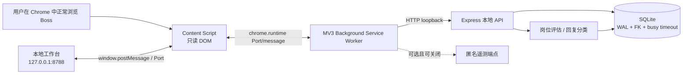
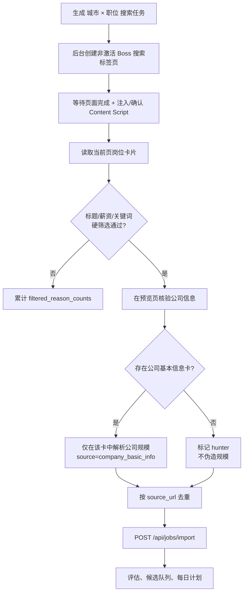
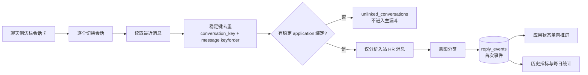
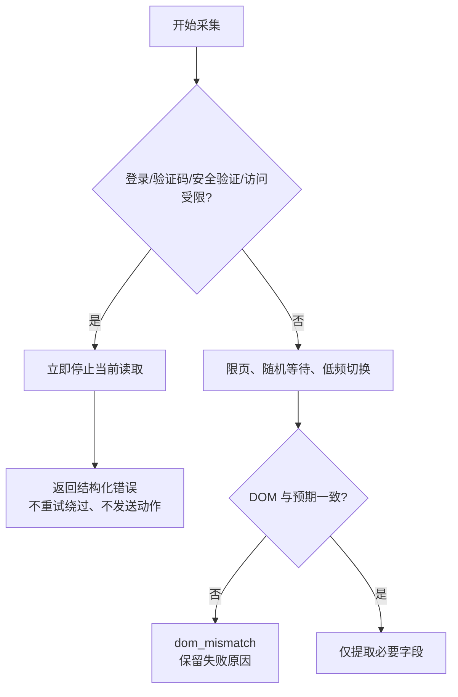
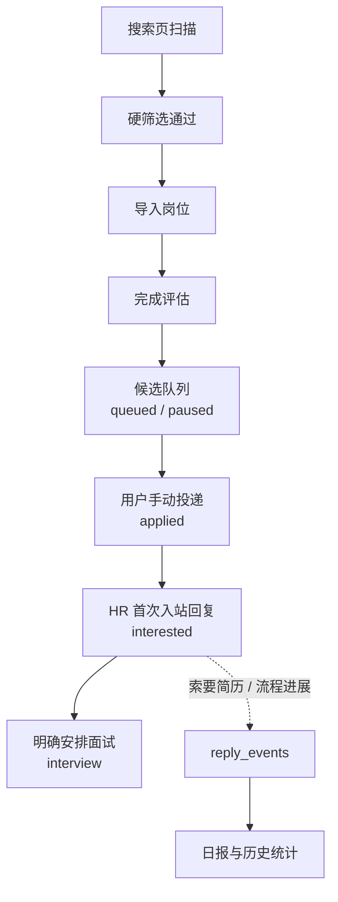
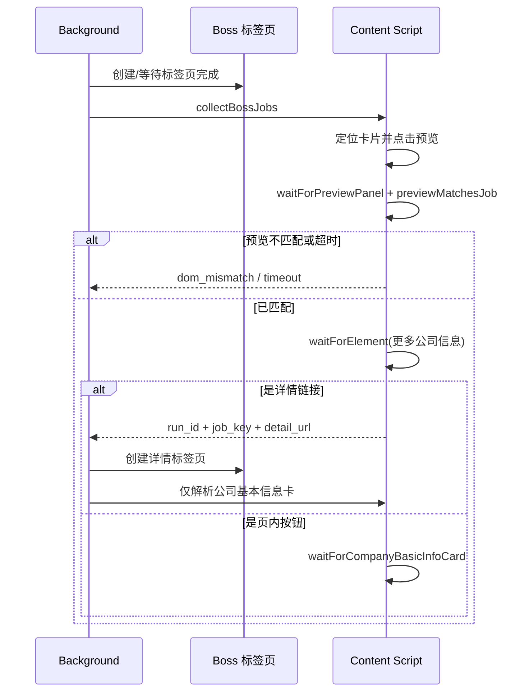
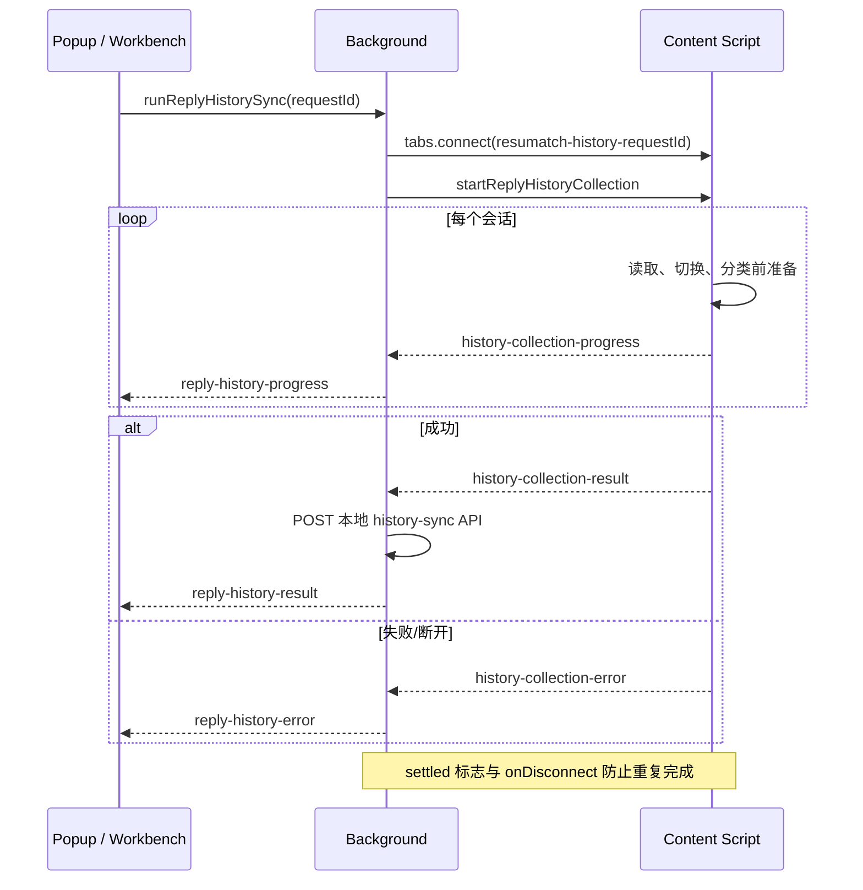

# ResuMatch Local Workbench

ResuMatch 是一个 **Local-first** 的招聘辅助工作台：Chrome 扩展只读取用户已打开的 Boss 页面，Node.js 本地服务在 `127.0.0.1:8788` 保存岗位、候选队列和历史回复统计。它帮助用户整理与评估信息；**不会自动投递、不会自动发送消息、不会绕过登录、验证码或平台风控。**

> 本项目处理的求职信息始终留在本机 SQLite 数据库。可选遥测仅发送匿名设备 UUID、有限的数值计数与固定枚举，不发送 URL、姓名、联系人、聊天内容或账号标识。

## 目录

- [能力与边界](#能力与边界)
- [快速开始](#快速开始)
- [系统架构](#系统架构)
- [岗位采集与候选队列](#岗位采集与候选队列)
- [历史回复统计重构计划](#历史回复统计重构计划)
- [风险控制策略](#风险控制策略)
- [漏斗模型与指标口径](#漏斗模型与指标口径)
- [DOM 竞态条件与跨标签页通信](#dom-竞态条件与跨标签页通信)
- [隐私与匿名遥测](#隐私与匿名遥测)
- [项目结构、API 与测试](#项目结构api-与测试)

## 能力与边界

### 已实现

- 从 Boss 职位列表页或详情页读取岗位，并导入本地工作台。
- 在后台创建非激活搜索标签页，按职位、城市与页数执行批量采集。
- 在**职位预览 → 更多信息 → 公司基本信息**的明确路径中核验公司规模；未核验时保留 `unverified`，不从 JD 或卡片全文猜测人数。
- 基于标题、薪资与关键词进行硬筛选；公司规模与地点仅作为软偏好，工作年限不是硬门槛。
- 默认由本地 Worker 评估岗位、生成问候语草稿与分析 HR 入站消息；云端 AI 必须显式开启。
- 历史聊天低频扫描、单会话失败隔离、稳定去重、按入站 HR 消息记录首个事件。
- 维护候选状态：`queued/paused → applied → interested → interview`；人工覆盖不会被自动同步回退。
- 提供默认关闭、可选择开启的匿名运行状态遥测。

### 明确不做

- 不点击投递、不替用户发送消息、不提交任何表单。
- 不规避验证码、登录、访问限制、风控页或平台限制。
- 不把本地 API 暴露到局域网或公网。
- 不通过联系人昵称做模糊绑定；无法稳定关联的会话进入 `unlinked_conversations`，不污染主统计。

## 快速开始

### 环境要求

- Node.js `>=22 <25`
- Google Chrome（用于加载 Manifest V3 扩展）

### 启动本地工作台

先在 Chrome Web Store 创建扩展草稿并取得**正式扩展 ID**。然后生成每台电脑独立的本机 Token；`.env` 不应提交到版本控制。

```powershell
npm install
npm run config:create -- -ExtensionId "你的正式扩展 ID"
.\Start-Workbench.ps1
```

脚本会创建 `.env` 并显示 Token。将该 Token 分别填入工作台首次弹出的 Token 窗口与扩展弹窗的“工作台 Token”字段。

若要以命令行方式启动，也可设置环境变量后运行：

```powershell
$env:WORKBENCH_EXTENSION_IDS = "你的正式扩展 ID"
$env:WORKBENCH_API_TOKEN = "至少 32 字符的随机 Token"
npm install
npm start
```

服务会在任一安全配置缺失时拒绝启动。

打开 [http://127.0.0.1:8788](http://127.0.0.1:8788)。启动器会等待 `GET /api/system/version` 可用；扩展自身不是本地服务健康检查。

### 开发环境加载扩展

1. 打开 `chrome://extensions`。
2. 开启“开发者模式”。
3. 点击“加载已解压的扩展程序”。
4. 选择 `browser-extension/` 目录。
5. 在已正常登录的 Boss 页面或本地工作台中使用扩展。

扩展文件变更后，请在 `chrome://extensions` 重新加载扩展，并刷新已打开的 Boss/工作台标签页，避免旧 content script 的扩展上下文失效。

### Chrome Web Store 发布与客户安装

1. 在 Chrome Web Store Developer Dashboard 首次上传 `npm run extension:package` 生成的 `dist/resumatch-extension.zip`，先保存为私有草稿或不公开发布。
2. 记录 Dashboard 分配的正式扩展 ID；该 ID 是本地服务白名单的一部分，不能用开发者模式的临时 ID 替代。
3. 用正式扩展 ID 为每位客户电脑执行 `npm run config:create -- -ExtensionId "..."`，并让客户保管输出的 Token。
4. 客户从 Chrome Web Store 安装扩展，首次打开扩展弹窗后粘贴该 Token；打开本地工作台时也粘贴同一 Token。
5. 客户在正常登录的 Boss 页面发起检索；系统仅生成岗位候选与问候语草稿，客户自行审核并决定是否发送。

发布 ZIP 只包含扩展运行所需文件与 PNG 图标；不会包含数据库、日志、诊断截图、`.env` 或 Chrome 调试配置。

## 系统架构



### 调用边界

| 组件 | 职责 | 禁止事项 |
| --- | --- | --- |
| `content-script.js` | 读取页面 DOM、识别列表/详情/聊天、回传结构化结果 | 发送消息、提交申请、上传页面数据 |
| `background.js` | 管理任务、创建采集标签页、跨标签页编排、导入本地服务 | 扩大 host permission、隐藏自动投递路径 |
| `src/server.js` | 提供 loopback API，协调导入、评估与统计 | 对外网监听 |
| `src/db.js` | 迁移、事务写入、状态推进、统计查询 | 拼接 SQL |
| `src/historySync.js` | 逐条历史消息分类与事件归档 | 会话级“一刀切”分类 |

## 岗位采集与候选队列



### 公司规模的可信度规则

公司规模是软偏好，但其来源必须可审计：

| 状态 | 含义 | 处理 |
| --- | --- | --- |
| `company_basic_info` | 在详情页“公司基本信息”卡中读取到 | 可作为已核验规模使用 |
| `no_company_basic_info` / `hunter` | 详情页没有公司基本信息卡 | 显示猎头岗位，不伪造规模 |
| `unverified` / `unknown` | 页面加载或解析失败 | 保持未知；失败不是猎头证据 |

列表卡、职位 JD 和卡片全文经常包含经验年限、团队人数等数字，因此**绝不能**从它们推断公司规模。

## 历史回复统计重构计划

### 目标与问题定义

历史聊天不能被压缩成“一个会话一个最终状态”。这会把普通流程进展误写成面试、将未知时间伪造成精确时间，并在联系人重名时错误关联岗位。重构后的统计目标是：以**入站 HR 单条消息**为事实单位，建立可去重、可追溯、可重跑的事件流。



### 当前约束

- 每次历史扫描最多 200 个会话，扫描中使用随机延迟；每 40 个会话执行 30–60 秒冷却。
- 每个会话独立记录 `switch_succeeded`、`failure_reason` 与未知时间；单条失败不会让整批数据失真。
- `conversation_switch_failed` 和 `message_parse_failed` 会进入失败计数，不能被当作成功。
- 消息时间无法解析时保留 `sent_at: null, time_precision: "unknown"`，不补造时间。
- `审核后确认` 之类的文案是流程进展，不等于面试；面试需要明确的时间、视频或到场安排。
- 自动状态只能前进；人工状态覆盖为不可被自动任务改写的边界。

### 分阶段计划

| 阶段 | 交付 | 验证标准 |
| --- | --- | --- |
| Phase 1：事实层 | 会话键、消息键、DOM 顺序、原始时间精度与失败原因持久化 | 同一消息重复读取不产生重复事件 |
| Phase 2：关联层 | 只以稳定 application binding 关联；未匹配会话隔离 | 重名联系人不创建或补写 application |
| Phase 3：事件层 | 对每条入站消息分类并持久化首次 `reply/resume/interview/process_progress` | 流程进展不被计为面试 |
| Phase 4：指标层 | 以首次联系日为锚点的绝对计数、主漏斗分母与补录分母分离 | 汇总与日表可相互校验 |
| Phase 5：回归层 | 为 200 会话批量、未知时间、重复消息、人工覆盖补齐测试 | `npm test` 覆盖关键边界 |

## 风险控制策略

### 平台操作风险



- 搜索任务页数受限（默认 3，最高 10）；历史任务上限 200 个会话。
- 对页面切换和历史扫描引入随机等待与分段冷却，不以高频轮询对抗页面行为。
- 遇登录、验证码、安全验证、访问受限、`captcha` 或 risk control 文案立即终止当前路径。
- `timeout_no_button`、`dom_mismatch`、`page_load_failed` 等是结构化失败码；失败不可被伪装为成功。
- 扩展只拥有 Boss 与 `127.0.0.1:8788` 的必要权限（以及可选遥测占位域名）。

### 数据与隐私风险

- SQLite 使用 WAL、外键和 5 秒 busy timeout；持久化操作保留事务边界并使用参数化 SQL。
- 本地 API 只监听 loopback；若要暴露到局域网或公网，必须先加入身份认证与 CSRF 防护。
- 不提交数据库、WAL/SHM、`node_modules`、日志、浏览器 profile、截图、密钥或 `.env` 文件。

## 漏斗模型与指标口径



### 计数原则

1. **扫描、筛选、导入、评估、候选、投递、回复、面试**是不同阶段，不能用一个“成功数”代替。
2. UI 的每一个计数都必须有 API 源计数；不得在前端截断、丢弃数据后仍报“成功”。
3. 主转化分母排除 `unlinked_conversations` 与旧的补录/合成记录；它们可单独展示，不能抬高主漏斗。
4. 日统计锚定首次联系日，不把后续事件伪装为发生在同步日。
5. 自动化只能推进 `queued/paused → applied → interested → interview`；人工覆盖优先。

## DOM 竞态条件与跨标签页通信

### 解决的 DOM 竞态

Boss 页面是动态渲染的：点击职位卡后预览面板可能尚未出现，面板可能属于其他岗位；“更多信息”可能是链接或按钮；点击会产生新标签页；聊天侧边栏滚动后旧节点也会失效。实现不是依赖固定 sleep，而是把异步页面动作拆成可验证的状态转换。



关键做法：

- 每次等待都有条件谓词，例如 `previewMatchesJob`、`waitForElement`、`waitForCompanyBasicInfoCard`，而不是只等待一个固定毫秒数。
- 用 `run_id + job_key` 保存详情链接，避免多个任务/页面混淆同一个岗位的后续详情页。
- 详情标签页在 `finally` 中关闭；异常不泄漏标签页。
- 历史扫描通过会话快照判断是否真正切换；失败会重试一次，再以 `conversation_switch_failed` 记录。
- DOM 无法解析时返回明确原因，并触发只含固定枚举的匿名错误事件；不传 DOM 文本、URL 或聊天内容。

### 为什么历史扫描使用 Port

长扫描超过普通 `chrome.runtime.sendMessage` 单响应的可靠时长。实现改为针对标签页建立 `chrome.tabs.connect` Port：后台将进度透传给工作台，最终通过同一 Port 返回结果或错误，并在任一侧断开时清理状态。



这一机制解决了三类问题：长任务响应通道提前关闭、进度不可见、重复结果/断开后状态悬挂。`settled` 标志确保 resolve/reject/断开只会完成一次；后台只允许一个活动的历史任务并维护订阅者集合。

## 隐私与匿名遥测

`browser-extension/telemetry.js` 是一个零依赖模块。默认开启，但用户可在扩展弹窗关闭“匿名运行状态数据”；`telemetry_enabled === false` 时，`trackEvent` 在创建 UUID 或发起 `fetch` 前返回。

| 事件 | 允许字段 | 用途 |
| --- | --- | --- |
| `app_launched` | 随机 UUID、扩展版本 | 每日活跃与版本分布 |
| `task_completed` | 请求数、成功数、跳过数、任务枚举 | 搜索与历史同步漏斗 |
| `error_triggered` | 错误枚举、`content_script` 来源 | DOM 漂移、验证码、登录跳转、超时告警 |

属性白名单会拒绝任意未定义字段。遥测 payload **不包含**真实 URL、HR 姓名、联系人、聊天内容、岗位标题、公司名称、账号 ID、Cookie 或浏览器指纹。接入真实遥测服务时，请替换 `TELEMETRY_ENDPOINT` 并同步收紧 `manifest.json` 的 host permission。

## 项目结构、API 与测试

```text
browser-extension/  MV3 扩展：后台、内容脚本、弹窗、匿名遥测
public/             本地工作台前端
src/                Express、SQLite、评估、候选与历史同步
tests/              Node 内置测试：数据库、规则、扩展契约、历史同步
scripts/            本地辅助脚本
```

常用 API 分组：

| 分组 | 端点 |
| --- | --- |
| 系统 | `GET /api/system/version`、`/api/system/browser-status` |
| 搜索与导入 | `/api/boss/search-tasks`、`POST /api/jobs/import`、`GET /api/candidates` |
| 工作流 | `/api/jobs/:id/evaluate`、`/api/applications/:id/mark-applied`、`ignore`、`later` |
| 历史回复 | `POST /api/boss/messages/sync`、`POST /api/boss/messages/history-sync`、`/api/replies/*` |
| 规划与指标 | `/api/metrics/daily`、`/api/plans/tomorrow` |

运行验证：

```powershell
npm test
npm run test:visual
```

提交前请确认 `npm test` 通过，并检查没有将 `data/`、浏览器 profile、日志、截图、`node_modules/` 或任何密钥加入版本控制。

## 贡献原则

1. 改动应小且局部；不要顺手重构无关代码。
2. 涉及持久化、采集或状态规则的修改必须新增/调整测试。
3. 新增接口默认仅 loopback，并为变化添加 API 级测试。
4. 新增中文 DOM 匹配字符串时，邻近匹配逻辑优先使用 Unicode escape，避免扩展打包或 shell 编辑损坏编码。
5. 安全、平台规则与用户隐私优先于功能完成率。
